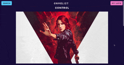
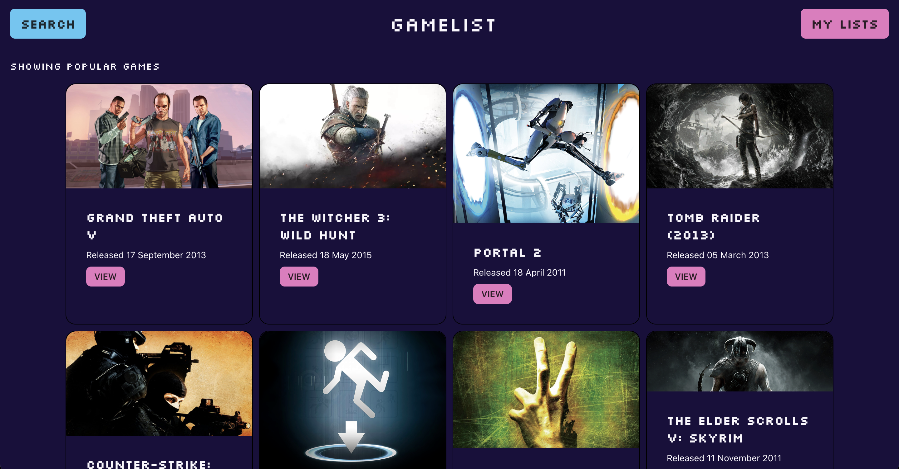
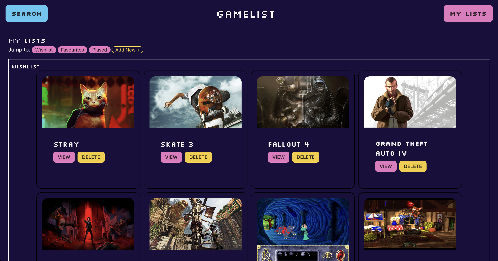
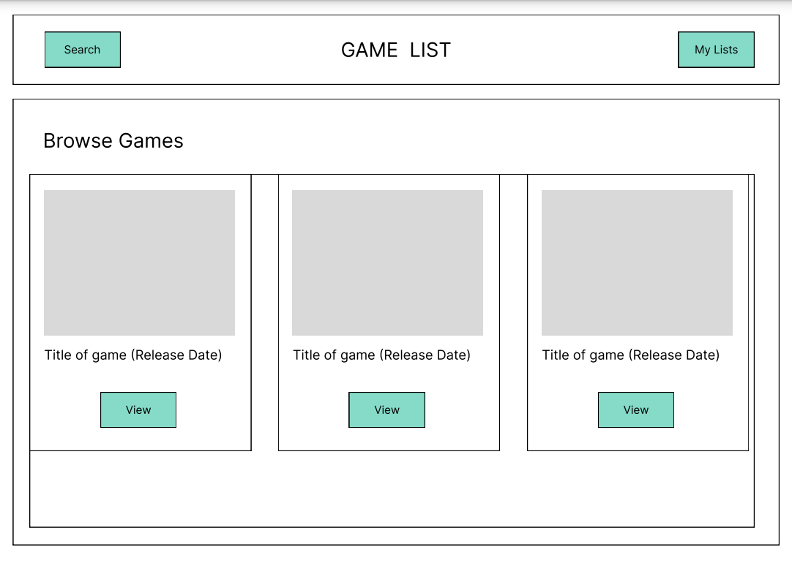
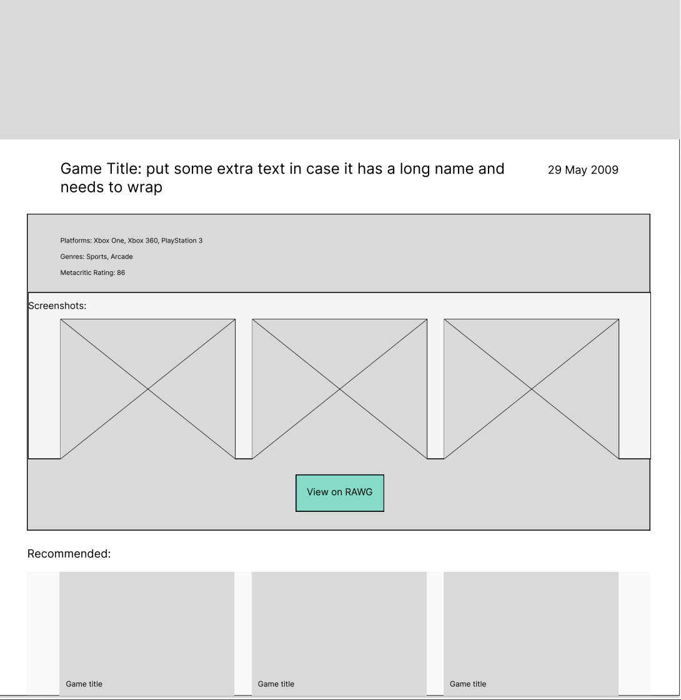

# Game List

My final project for General Assembly JavaScript Development.

### Screenshots

  

  

## Plan

To create a single page app which sends an AJAX request to the RAWG.io video game database API.  
Users can browse games, and create their own lists of games with their own notes added to each game in a list, such as a rating or comment.  

The app will have five 'pages': 
- A home/search page which defaults to a search form and list of games (showing the 20 most popular by default). When the user types a query into the search input, the list of games is populated by games matching the user's search query.  
- a detailed view of a single game from this list or from one of the user's lists - if the user has added notes to a game there should be a way to view these notes from the single game view. 
- a 'my game lists' page, which shows all lists the user has created.  
- STILL TO COME: a detailed view of a users list, showing the games and any notes the user has added, maybe in a table?  

### Wireframes

Search results:  

View game:  

#### TODO:

- add routes for pagination
- set up custom list functionality
- add github repo link to footer
- show the number of screenshots
- add a favicon to replace default react icon
- move the footer into a component
- lists section should side scroll - try this: set items not to shrink or grow, or wrap, and set overflow to scroll. 

<!-- - add wireframes and screenshots to readme -->

## Deployment

The app will be hosted on Netlify [here](https://jsd-game-list.netlify.app/)  
The purpose for this instead of using gh-pages was to hide my API key for the RAWG.io API, using Netlify functions.  
 

## Build and routing

The app is built with React, using React Router to create links. I am also using Tailwind CSS and DaisyUI for Tailwind components.  

## User Data

User data (the custom lists) are saved and retrieved from  `localStorage`.  
On the one hand, the user is tied to the device and browser they create their lists in. On the other hand, there is no need to create an account and log in to yet another app in the world. 

## Resources

- http://www.figma.com
- https://api.rawg.io/docs
- https://rawgthedocs.orels.sh/api
- https://corsproxy.io/
- https://react.daisyui.com
- https://daisyui.com/docs/
- https://github.com/AdeleD/react-paginate

## Future Features

- View a page for a specific developer showing their games. 
- View games by most popular in a genre
- Search for trending or most popular games

## Technical Hurdles

### Pagination

I went around in circles with this for a while. I even tried making a separate component then realised I couldn't get the search query. Eventually I moved the entire axios request into useEffect and installed `react-paginate` to handle the rest. But another problem - I had an if/else to call the API with /games instead of /games/search if the user didn't enter a query. But the render was triggering before the request was finished (even though loading was set to true). I remembered something our class instructor said about expressions in jsx needing to return something, and applied that same principle to the actual call to the URL! I used a ternary within the axios call to decide which url to use. 

### useEffect infinite loop

In the MyLists component, I call the wishlist key from localStorage. Setting this list as the dependency triggers an infinite loop as the key gets called and set within useEffect. I read [this post by Dan Abromov](https://overreacted.io/a-complete-guide-to-useeffect/) and created a boolean `listChanged` and use that as the dependency instead - so when a user deletes a game from the list, `listChanged` is updated to true. This works once. But when the user deletes another game straightaway the view does not update. This is fixed by also updating the `wishlist` variable in state. Then it triggers a re-render.  

## Conclusion

I learned a lot from creating this project, I really enjoyed using React. It's only my first React project, so it's very basic, but I'm excited to explore this further. 
